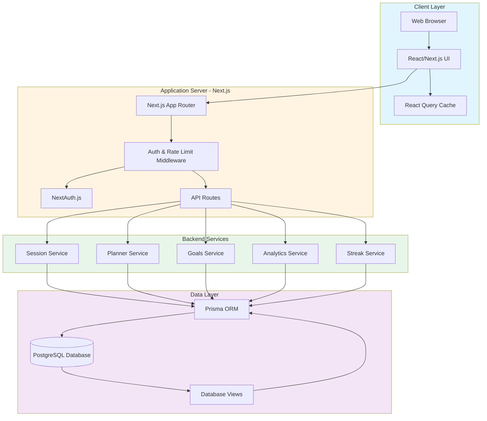
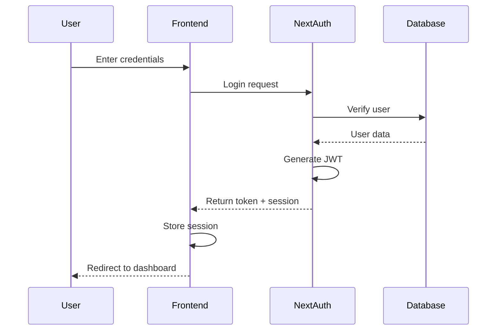
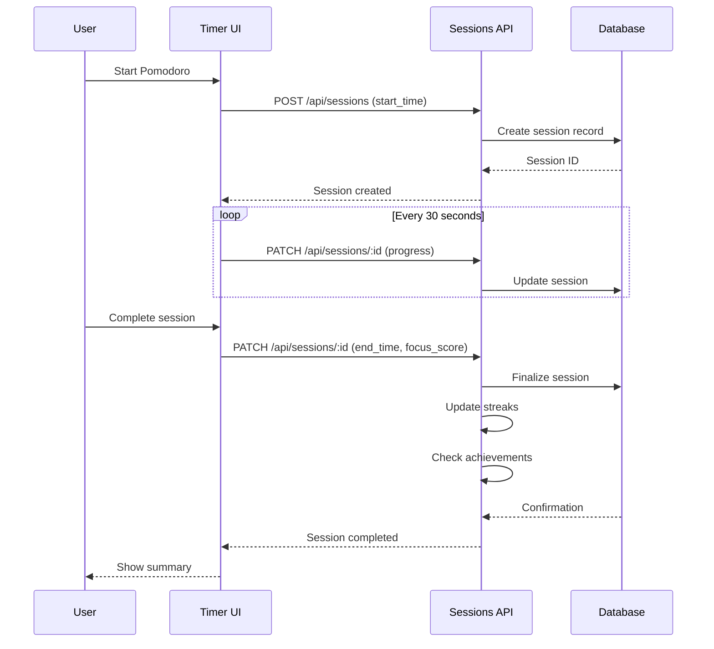
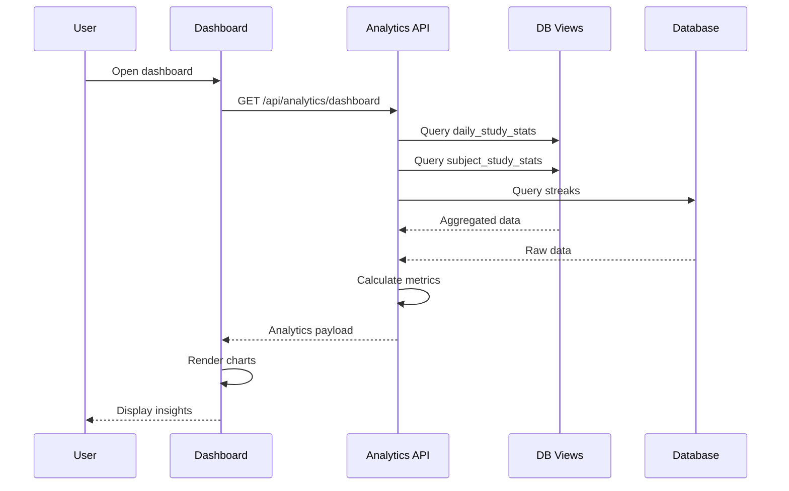
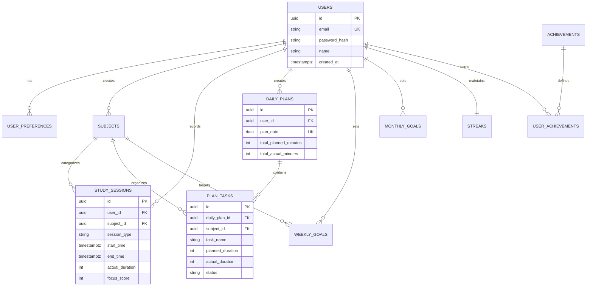
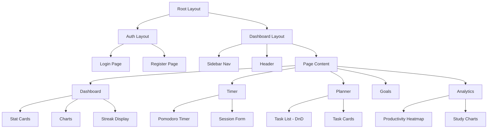
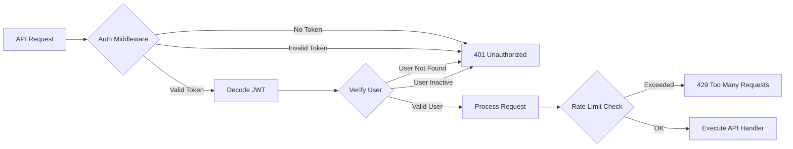
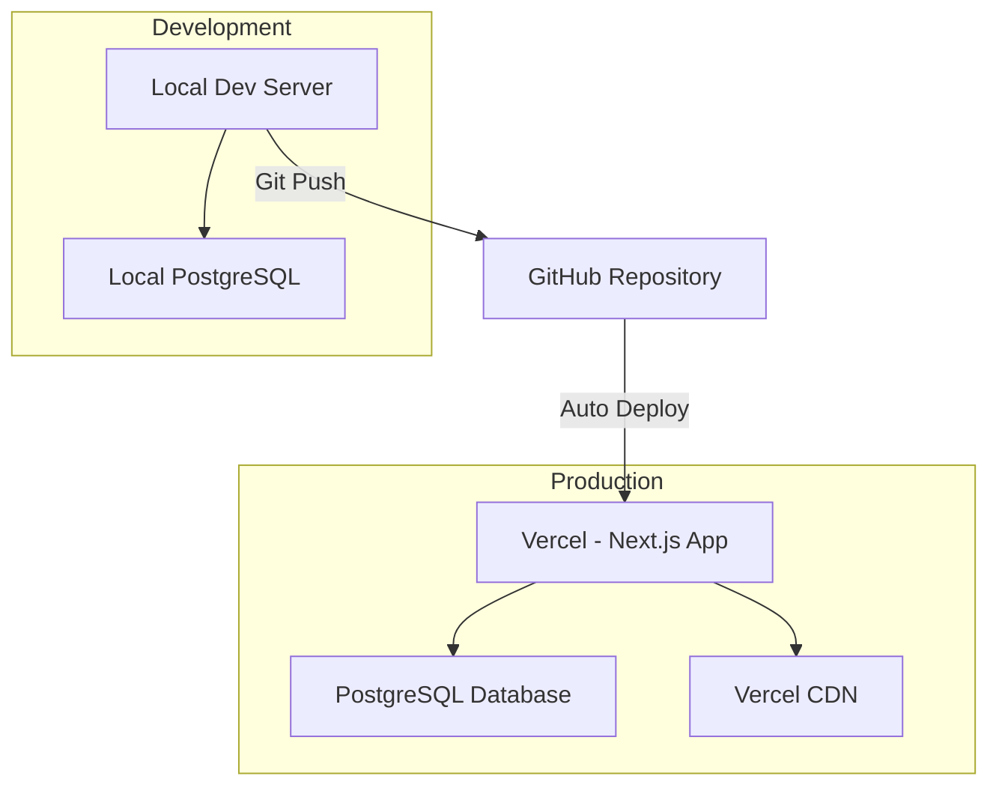

# StudyOS - System Architecture Documentation

## 📋 Project Overview

**StudyOS** is a full-stack study productivity web application that helps students study consistently using Pomodoro timers, focus tracking, customizable study planners, and detailed analytics. The system tracks daily, weekly, and monthly study hours, compares planned vs actual effort, and encourages discipline through streaks and achievement badges.

---

## 🏗️ System Architecture



---

## 🔄 Data Flow Diagrams

### User Authentication Flow


### Study Session Flow


### Analytics Generation Flow


---

## 🗄️ Database Schema Overview

### Entity Relationship Diagram


### Key Database Features
- **UUIDs as Primary Keys**: Better for distributed systems and security
- **Cascade Deletion**: User deletion automatically removes all related data
- **Indexes**: Optimized for common queries (user_id, dates, status)
- **Check Constraints**: Data validation at database level
- **Triggers**: Auto-update `updated_at` timestamps
- **Views**: Pre-computed statistics for analytics

---

## 🔌 API Architecture

### API Route Structure
```
/api
├── /auth
│   ├── /[...nextauth]      # NextAuth.js handlers (GET, POST)
│   └── /register           # User registration (POST)
│
├── /sessions
│   ├── /                   # List/create sessions (GET, POST)
│   └── /[id]               # Update/delete session (PATCH, DELETE)
│
├── /planner
│   ├── /                   # Create/list plans (GET, POST)
│   ├── /[id]               # Update plan (PATCH)
│   └── /tasks
│       ├── /               # Create task (POST)
│       └── /[id]           # Update/delete task (PATCH, DELETE)
│
├── /goals
│   ├── /weekly
│   │   ├── /               # List/create weekly goals (GET, POST)
│   │   └── /[id]           # Update weekly goal (PATCH)
│   └── /monthly
│       ├── /               # List/create monthly goals (GET, POST)
│       └── /[id]           # Update monthly goal (PATCH)
│
├── /analytics
│   ├── /dashboard          # Dashboard stats (GET)
│   └── /insights           # Advanced insights (GET)
│
├── /subjects
│   ├── /                   # List/create subjects (GET, POST)
│   └── /[id]               # Update/delete subject (PATCH, DELETE)
│
└── /preferences            # Get/update preferences (GET, PATCH)
```

### API Response Format
```typescript
// Success Response
{
  "success": true,
  "data": { ... },
  "message": "Operation successful"
}

// Error Response
{
  "success": false,
  "error": {
    "code": "ERROR_CODE",
    "message": "Human-readable error message",
    "details": { ... }
  }
}
```

---

## 🎨 Frontend Architecture

### Page Structure
```
app/
├── (auth)/
│   ├── login/              # Login page
│   └── register/           # Registration page
│
├── (dashboard)/
│   ├── layout.tsx          # Protected layout with sidebar
│   ├── dashboard/          # Main dashboard
│   ├── timer/              # Pomodoro/Focus timer
│   ├── planner/            # Daily planner
│   ├── goals/              # Goals management
│   ├── analytics/          # Analytics & insights
│   ├── history/            # Session history
│   └── settings/           # User settings
│
└── api/                    # API routes
```

### Component Hierarchy


### State Management Strategy
- **Server State**: React Query for API data caching and synchronization
- **UI State**: React useState for local component state
- **Global State**: React Context for theme, user preferences
- **Form State**: React Hook Form for form handling

---

## 🔐 Security Architecture

### Authentication & Authorization


### Security Measures
1. **Password Security**
   - bcrypt hashing with salt rounds (12)
   - Minimum password requirements enforced

2. **JWT Tokens**
   - Short-lived access tokens (1 hour)
   - HTTP-only cookies for session storage
   - Automatic token refresh

3. **API Protection**
   - Rate limiting (100 requests/15 min per user)
   - Input validation with Zod schemas
   - SQL injection prevention (Prisma ORM)
   - CORS configuration

4. **Data Privacy**
   - User data isolation (all queries filtered by user_id)
   - Cascade deletion on account removal
   - No sensitive data in client-side storage

---

## 📊 Analytics & Reporting

### Key Metrics Tracked
1. **Study Time Metrics**
   - Total study time (daily/weekly/monthly)
   - Subject-wise breakdown
   - Session count and average duration

2. **Quality Metrics**
   - Average focus score
   - Interruption count
   - Completion rate

3. **Planning Metrics**
   - Planned vs actual time comparison
   - Task completion rate
   - Goal achievement percentage

4. **Engagement Metrics**
   - Study streaks (current/longest)
   - Total study days
   - Achievements earned

### Database Views for Analytics
- `daily_study_stats`: Pre-aggregated daily statistics
- `subject_study_stats`: Subject-wise study time totals
- Real-time queries for custom date ranges

---

## 🚀 Performance Optimization

### Database Optimization
- Indexed columns for frequent queries
- Database views for complex aggregations
- Connection pooling with Prisma
- Efficient cascade rules

### Frontend Optimization
- Server-side rendering with Next.js
- React Query caching (5-minute stale time)
- Code splitting and lazy loading
- Optimized images with Next.js Image

### API Optimization
- Response pagination for large datasets
- Conditional requests (ETag, Last-Modified)
- Compression middleware
- Query optimization (select specific fields)

---

## 📱 Responsive Design Strategy

### Breakpoints
- Mobile: 0-640px
- Tablet: 641-1024px
- Desktop: 1025px+

### Mobile Adaptations
- Collapsible sidebar → Bottom navigation
- Stacked cards instead of grid
- Touch-optimized timer controls
- Simplified analytics charts

---

## 🔄 Data Synchronization

### Auto-Save Strategy
- Timer sessions auto-save every 30 seconds
- Optimistic updates for instant UI feedback
- Conflict resolution (last write wins)
- Local storage backup for offline resilience

### Real-time Features
- Session progress updates
- Streak calculations on session completion
- Achievement unlocks

---

## 📦 Deployment Architecture



### Environment Strategy
- **Development**: Local PostgreSQL, hot reload
- **Production**: Managed PostgreSQL (e.g., Vercel Postgres, Supabase), CDN optimization

---

## 📚 Technology Stack Summary

| Layer | Technology | Purpose |
|-------|-----------|---------|
| Frontend | Next.js 14, React 18 | Server-side rendering, routing |
| Styling | Tailwind CSS, shadcn/ui | Responsive design, components |
| State | React Query, Context | Server/client state management |
| Backend | Next.js API Routes | RESTful API endpoints |
| Auth | NextAuth.js | Authentication & sessions |
| Database | PostgreSQL | Relational data storage |
| ORM | Prisma | Type-safe database access |
| Validation | Zod | Input validation |
| Charts | Recharts | Data visualization |
| DnD | @dnd-kit/core | Drag-and-drop planner |

---

## 📝 API Endpoints Reference

### Authentication
- `POST /api/auth/register` - Register new user
- `POST /api/auth/signin` - Login
- `POST /api/auth/signout` - Logout

### Study Sessions
- `POST /api/sessions` - Create session
- `GET /api/sessions?from=&to=&subject=` - List sessions
- `PATCH /api/sessions/:id` - Update session
- `DELETE /api/sessions/:id` - Delete session

### Daily Planner
- `POST /api/planner` - Create daily plan
- `GET /api/planner?date=YYYY-MM-DD` - Get plan by date
- `POST /api/planner/tasks` - Add task
- `PATCH /api/planner/tasks/:id` - Update task
- `DELETE /api/planner/tasks/:id` - Delete task

### Goals
- `POST /api/goals/weekly` - Create weekly goal
- `GET /api/goals/weekly?week=YYYY-WW` - Get weekly goals
- `PATCH /api/goals/weekly/:id` - Update goal
- `POST /api/goals/monthly` - Create monthly goal
- `GET /api/goals/monthly?month=YYYY-MM` - Get monthly goals

### Analytics
- `GET /api/analytics/dashboard` - Get dashboard stats
- `GET /api/analytics/insights?period=week|month` - Get insights

### Subjects
- `GET /api/subjects` - List user subjects
- `POST /api/subjects` - Create subject
- `PATCH /api/subjects/:id` - Update subject
- `DELETE /api/subjects/:id` - Archive subject

### Preferences
- `GET /api/preferences` - Get user preferences
- `PATCH /api/preferences` - Update preferences

---

This architecture provides a scalable, secure, and maintainable foundation for StudyOS with clear separation of concerns and optimized performance.
